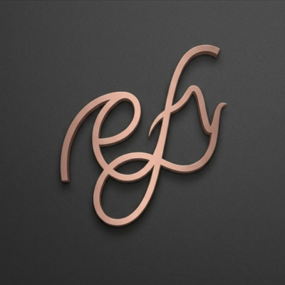

<div align="center">
  

  # Rifly
  
  **The Audiophile-Grade Desktop Music Player.**

  [](https://tauri.app/)
  [](https://vuejs.org/)
  [](https://www.rust-lang.org/)
  [](LICENSE)

  *A beautiful, lightning-fast, and bit-perfect audio player combining local high-resolution playback with seamless Spotify Premium integration.*
</div>

---

## Features

- **Audiophile Grade Playback**: Native support for high-resolution formats including **FLAC, DSD (DSF/DFF), ALAC, WAV, APE, and WavPack**.
- **Bit-Perfect Audio Engine**: Built on top of Rust's `cpal` and `symphonia` for raw, unadulterated sound delivery (WASAPI exclusive mode ready).
- **Spotify Integration**: Connect your Spotify Premium account to search, browse playlists, and stream tracks directly within Rifly.
- **Modern Frameless UI**: A sleek, custom-designed Vue 3 interface inspired by modern design trends, featuring dynamic glassmorphism and fluid micro-animations.
- **Discord Rich Presence**: Show off your audiophile taste. Displays bit-depth, sample rate, and "Bit Perfect" badges on your Discord profile.
- **Blazing Fast**: The backend is written entirely in Rust, ensuring instant folder scanning and minimal memory footprint.

## Screenshots

## Architecture

Rifly leverages the **Tauri v2** framework to bridge a highly performant Rust backend with a reactive web frontend:

- **Frontend**: Vue 3 (Composition API), Vite, TypeScript, Pinia (State Management), and raw CSS for a bloat-free design.
- **Backend (Rust)**:
  - `cpal` - Cross-platform audio I/O.
  - `symphonia` - Audio decoding and demuxing.
  - `lofty` - Metadata and cover art extraction.
  - `discord-rich-presence` - IPC communication with Discord.

## Getting Started

### Prerequisites
- [Node.js](https://nodejs.org/) (v18+)
- [Bun](https://bun.sh/) (Optional but recommended for fast package management)
- [Rust](https://rustup.rs/) (latest stable)

### Installation

1. **Clone the repository:**
   ```bash
   git clone https://github.com/yourusername/rifly.git
   cd rifly
   ```

2. **Install dependencies:**
   ```bash
   bun install
   # or npm install
   ```

3. **Run the development server:**
   ```bash
   bun run dev
   ```
   This will start the Vite frontend server and compile the Tauri Rust backend.

4. **Build for production:**
   ```bash
   bun run build
   ```

## Configuration & Integrations

Rifly is designed to be highly customizable. While local playback works out of the box, connecting external services requires a few manual steps to ensure you maintain full control over your API keys and data.

### 1. Spotify Premium Integration

To enable Spotify streaming directly within Rifly, you must provide your own Spotify Developer Client ID.

**Step-by-step Guide:**
1. Navigate to the [Spotify Developer Dashboard](https://developer.spotify.com/dashboard/) and log in with your Premium account.
2. Click on **"Create App"**.
3. Fill in the required details (App Name: `Rifly`, App Description: `Desktop Audio Player`).
4. **Critical Step:** In the **Redirect URIs** field, you must add exactly `http://localhost:1424/callback`. Rifly hosts a temporary local server on this port to capture the authentication token.
5. Save the application, navigate to its settings, and copy your **Client ID**.
6. Open Rifly, go to the **Settings** tab, paste the Client ID into the Spotify section, and click **Connect**.

### 2. Discord Rich Presence (RPC)

Rifly features an advanced Discord RPC integration that not only shows what you are listening to, but also displays high-resolution metadata (e.g., "FLAC • 24-bit • 192kHz" or "DSD256 Native") and an "Audiophile Mode" badge. 

To enable this, you need to register a custom Discord Application.

**Step-by-step Guide:**
1. Navigate to the [Discord Developer Portal](https://discord.com/developers/applications).
2. Click **"New Application"** in the top right corner. Name it `Rifly` (or whatever name you want to appear on your profile, e.g., "High-Res Audio").
3. Copy the **Application ID (Client ID)** from the General Information tab.
4. **Setting up the Cover Art Placeholder:**
   - In the left sidebar, navigate to **Rich Presence -> Art Assets**.
   - Click **Add Image(s)** and upload the Rifly logo or any image you prefer.
   - **Important:** You must name this image exactly `rifly_logo`. The backend explicitly looks for this key to display the large image thumbnail.
   - Save your changes.
5. Open Rifly, navigate to the **Settings** tab, and locate the Discord Rich Presence section.
6. Paste your Client ID and toggle the display settings to your preference (Title, Artist, Audio Quality, etc.).

## Contributing

Contributions, issues, and feature requests are welcome! Feel free to check the [issues page](https://github.com/Araryarch/rifly/issues).

1. Fork the Project
2. Create your Feature Branch (`git checkout -b feature/AmazingFeature`)
3. Commit your Changes (`git commit -m 'Add some AmazingFeature'`)
4. Push to the Branch (`git push origin feature/AmazingFeature`)
5. Open a Pull Request

## License

Distributed under the MIT License. See `LICENSE` for more information.

---
<div align="center">
  <i>Built for audiophiles.</i>
</div>
